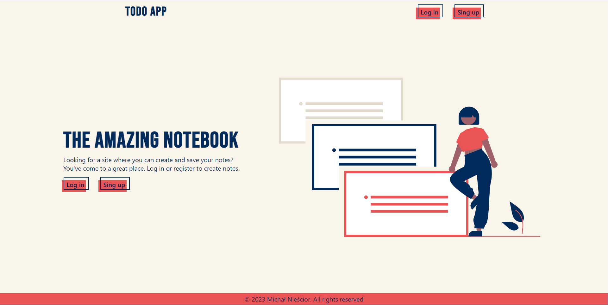

# Notebook 📝

  

## Project Overview 🎉

This app is a notebook. The user of the Notebook can add, edit and delete notes, as well as register and log in. The frontend of the app is based on Vite + React, and the backend is based on Express + MongoDB.

## Live 📍

[https://weather-report-site.netlify.app](https://notebook-app-gold.vercel.app/)

## Code Example/Issues 🔍

If you have any issues, please let me know in the issues section or directly to michal.niescior1@gmail.com

## Tech/framework used 🔧
* Frontend Stack
  * Vite 4
  * React 18
  * React Hook Form 7
  * React Router Dom 6
  * React Query 3
  * React Responsive Masonry 2
  * Framer Motion
  * Styled Components
  * Font Awesome
  * Axios
* Backend
  * Express
  * Mongoose
  * Mongoose Url Slugs
  * JSON Web Token
  * Passport / passport-jwt / passport-local / passport-local-mongoose
  * Dotenv
  * EJS
  * Nodemon

## Installation 💾

git clone [https://github.com/MajkelN/weather-app](https://github.com/MajkelN/notebook.git)  
cd frontend  
npm install  
cd server  
npm install  
npm run dev OR npm run server

## Available scripts 💻

| Command Server            | Description                       |
| ------------------------- | --------------------------------- |
| `npm run dev`             | Start local server and frontend   |
| `npm run client`          | Start frontend app                |
| `npm run server`          | Start local server                |

| Command Frontend          | Description                       |
| ------------------------- | --------------------------------- |
| `npm run dev`             | Start frontend app                |
| `npm run build`           | Create optimized build            |
| `npm run preview`         | Open preview                      |
